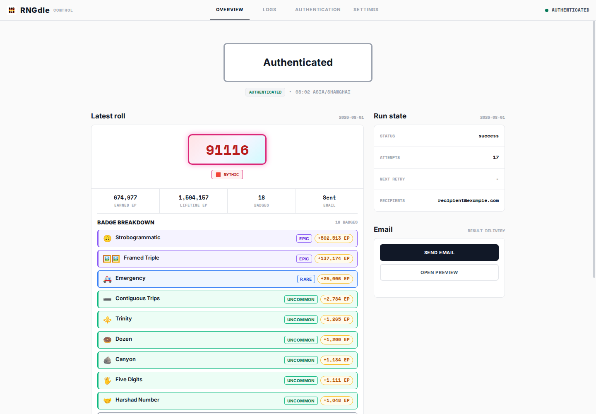
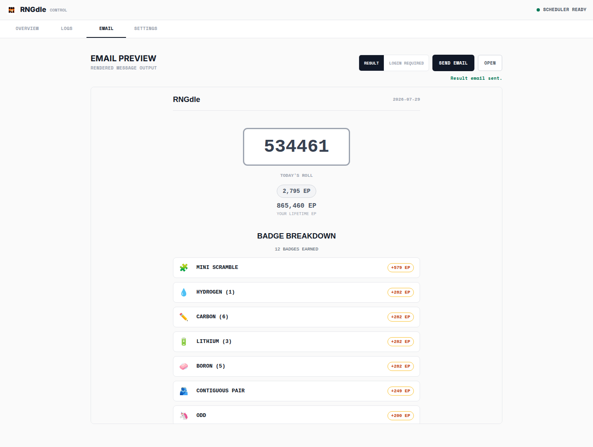
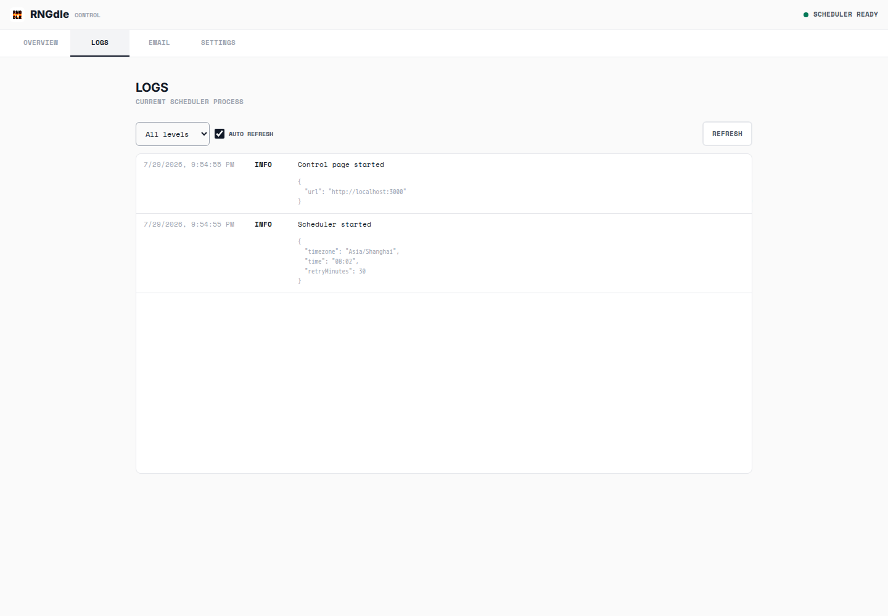
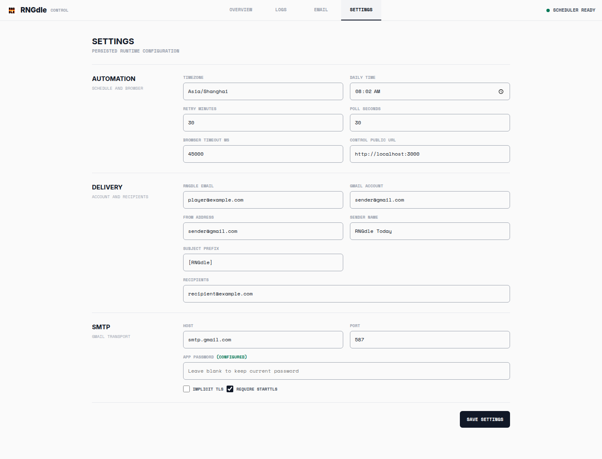
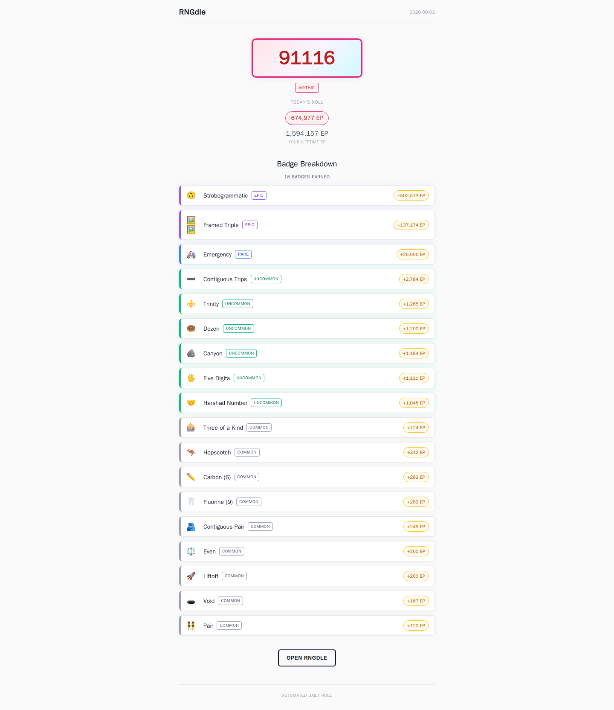

# RNGdle Automation

> Self-hosted RNGdle automation with persistent login, retry-safe scheduling, Gmail reports, and a local control dashboard.

每天在 UTC+8 `08:02` 自动完成 [RNGdle](https://www.rngdle.com) roll，读取当天数字、获得 EP、Lifetime EP 与 badges，并通过 Gmail 发送结果邮件。项目使用持久化浏览器会话、幂等状态记录和 Docker Compose 常驻运行。

[快速开始](#快速开始) · [配置参考](#配置参考) · [Control 页面](#control-页面) · [重试与幂等](#重试与幂等) · [运维](#常用运维) · [安全](#安全)



## 核心能力

| 能力 | 实现 |
| --- | --- |
| 自动调度 | 默认每天 `08:02 Asia/Shanghai` 执行，失败后每 30 分钟重试 |
| 持久登录 | Playwright persistent context 保存 cookies；失效后进入交互认证 |
| 幂等执行 | 已有 roll 直接复用；邮件失败只重试投递，不会再次生成数字 |
| 邮件报告 | Gmail SMTP 同时发送 RNGdle 风格 HTML 与纯文本结果 |
| Control | 提供状态、结构化日志、邮件预览、认证入口和运行时设置 |
| 容器部署 | Compose 管理 scheduler、数据卷和健康检查，无需 VNC |

Control 自托管 Inter 与 Space Mono 字体。运行状态保存在 `state.json`，默认只保留最近 45 天；网页修改的配置会立即生效并持久化到数据卷。

## 工作流程

```text
08:02 UTC+8
    |
    v
读取 state.json ---- 今日已成功 ----> 跳过
    |
    v
检查 /api/home ---- 登录失效 ----> 邮件提醒 + Control 页面等待认证
    |
    v
已有今日结果? ---- 是 ----> 复用结果
    | 否
    v
点击 GENERATE
    |
    v
保存结果 ----> Gmail 发送 ----> 标记 success
```

RNGdle 当前使用 email magic link 和 Cloudflare Turnstile，而不是数字验证码。Turnstile 在宿主机浏览器完成，magic link 由容器内的 headless Chromium 打开并保存会话。

## 运行模式

| 模式 | 用途 | 启动方式 |
| --- | --- | --- |
| `scheduler` | 常驻调度和自动重试 | `docker compose up -d scheduler` |
| `auth` | 首次登录或手动更新会话 | `docker compose --profile tools run --rm --service-ports auth` |
| `once` | 立即检查一次，仍遵守每日幂等状态 | `docker compose --profile tools run --rm --service-ports once` |

## 环境要求

推荐运行方式：

- Docker Engine
- Docker Compose v2
- 可访问 `www.rngdle.com` 和 `smtp.gmail.com`

本地开发还需要：

- Node.js 22 或更高版本
- pnpm 11.17.0

## 快速开始

### 1. 创建配置

```bash
install -m 600 .env.example .env
cp config/config.example.yaml config/config.yaml
chmod 600 config/config.yaml
```

至少填写：

```dotenv
RNGDLE_EMAIL=your-rngdle-account@example.com

SMTP_USER=sender@gmail.com
SMTP_APP_PASSWORD=your-google-app-password
MAIL_TO=receiver@example.com
```

`RNGDLE_EMAIL` 与 Gmail 发件地址可以不同。不要将 Google 账号主密码填入 `SMTP_APP_PASSWORD`。

### 2. 配置 Gmail

1. 为 Google 账号开启两步验证。
2. 在 Google 账号安全设置中创建应用专用密码。
3. 将生成的 16 位应用专用密码写入 `SMTP_APP_PASSWORD`。
4. `SMTP_USER` 填写完整 Gmail 地址。

Google Workspace 账号是否允许应用专用密码取决于管理员策略。

### 3. 首次认证 RNGdle

```bash
docker compose --profile tools run --rm --service-ports auth
```

打开 [http://localhost:3000](http://localhost:3000)：

1. 点击 `REQUEST SIGN-IN LINK` 打开 RNGdle。
2. 输入 `RNGDLE_EMAIL`，完成 Turnstile 并请求登录邮件。
3. 不要在普通浏览器中消费 magic link；复制完整的 `https://...rngdle.com/...` 地址。
4. 将地址粘贴到 Control 页面并提交。
5. 页面显示 `Authenticated` 后，认证容器自动退出。

magic link 只允许 HTTPS 的 `rngdle.com` 域名。浏览器 profile 保存在 Docker volume，后续启动会直接复用。

> [!NOTE]
> RNGdle 强制使用绑定官网域名的 Cloudflare Turnstile。Control 无法直接请求登录邮件，因此 `REQUEST SIGN-IN LINK` 必须打开官网完成验证；这一步不能由容器安全绕过。

### 4. 启动调度器

```bash
docker compose up -d scheduler
docker compose ps scheduler
docker compose logs -f scheduler
```

Control 页面位于 [http://localhost:3000](http://localhost:3000)。健康状态应为 `healthy`。

## 配置参考

Docker Compose 从 `.env` 注入启动配置，[config/config.example.yaml](config/config.example.yaml) 展示结构化映射和校验规则。

| 变量 | 默认值 | 说明 |
| --- | --- | --- |
| `TZ` | `Asia/Shanghai` | 调度所用 IANA 时区 |
| `SCHEDULE_TIME` | `08:02` | 每日执行时间，24 小时制 `HH:mm` |
| `RETRY_MINUTES` | `30` | 当天未成功时的重试间隔 |
| `POLL_SECONDS` | `30` | 调度状态轮询间隔 |
| `RNGDLE_EMAIL` | 必填 | RNGdle 登录邮箱 |
| `RNGDLE_BASE_URL` | `https://www.rngdle.com` | RNGdle 地址 |
| `SMTP_HOST` | `smtp.gmail.com` | SMTP 服务器 |
| `SMTP_PORT` | `587` | STARTTLS 端口 |
| `SMTP_SECURE` | `false` | `587` 使用 STARTTLS，因此为 `false` |
| `SMTP_REQUIRE_TLS` | `true` | 强制升级 TLS |
| `SMTP_AUTH_MODE` | `password` | Gmail 应用专用密码模式 |
| `SMTP_USER` | 必填 | 完整 Gmail 发件地址 |
| `SMTP_APP_PASSWORD` | 必填 | Google 应用专用密码 |
| `MAIL_FROM` | `SMTP_USER` | 邮件 From；留空时使用 SMTP 用户 |
| `MAIL_FROM_NAME` | `RNGdle Today` | 收件箱中显示的发件人昵称 |
| `MAIL_TO` | 必填 | 一个或多个收件人，逗号分隔 |
| `MAIL_SUBJECT_PREFIX` | `[RNGdle]` | 邮件标题前缀 |
| `CONTROL_PORT` | `3000` | 容器内 Control 端口 |
| `CONTROL_PUBLIC_URL` | `http://localhost:3000` | 登录失效邮件中的 Control 地址 |
| `BROWSER_HEADLESS` | `true` | 自动任务是否使用 headless Chromium |
| `BROWSER_TIMEOUT_MS` | `45000` | 页面及 API 操作超时 |

`${VARIABLE}` 缺失时程序会拒绝启动；`${VARIABLE:-default}` 会使用默认值。`.env` 与实际 `config/config.yaml` 已在 `.gitignore` 和 `.dockerignore` 中排除。

Control 的 Settings 页面会将修改写入 `/app/data/settings.json`，其优先级高于 `.env`/YAML，并在当前进程立即生效。容器重启后会再次加载这些覆盖值。由于 `.env` 是启动安全基线，其中的必填变量仍然必须有效。

以下配置仍只通过文件或 Docker 环境变量管理：`RNGDLE_BASE_URL`、`SMTP_AUTH_MODE`、`CONTROL_PORT`、`BROWSER_HEADLESS` 和数据目录。

## Control 页面

Control 将品牌、四视图导航和 scheduler 状态集中在页面 header 中。移动端导航保留在 header 第二行，四个入口等宽排列。

页面主区域、Logs 面板与 Email Preview 使用本地打包的 `perfect-scrollbar`，内容刷新、视图切换和窗口缩放后会自动同步滚动范围；脚本不可用时回退到原生滚动。

四个视图分别提供：

| 视图 | 功能 |
| --- | --- |
| `Overview` | Scheduler 状态、最近 roll、EP、badges、邮件状态、重试信息和 RNGdle 认证 |
| `Logs` | 当前进程最近 250 条结构化日志、级别筛选、手动与自动刷新 |
| `Email` | 预览并手动发送最近结果邮件或登录失效邮件 |
| `Settings` | 热更新调度、浏览器超时、账号、收件人、主题和 Gmail SMTP 参数 |







顶部状态区域展示三个主要认证状态：

| 状态 | 含义 |
| --- | --- |
| `idle` | Scheduler 正常运行，没有等待人工操作 |
| `waiting` | RNGdle 登录失效，等待提交 magic link |
| `authenticated` | 新会话已确认，待执行任务将继续 |

Settings 中的 App Password 输入始终为空，只显示 `(configured)` 或 `(missing)`。留空保存会保留现有密码；输入新值才会替换。设置文件使用 `0600` 权限原子写入。

Logs 只保留当前 scheduler 进程最近 250 条记录，容器重启后清空；需要长期历史时使用 `docker compose logs` 或配置 Docker 日志驱动。Email 视图发送前会确认当前模板和收件人；手动发送会写入日志，但不会改变每日任务状态。

Control 页面使用的本地 API：

| 方法与路径 | 用途 |
| --- | --- |
| `GET /api/overview` | Scheduler、最近任务和结果摘要 |
| `GET /api/logs` | 结构化日志；支持 `level`、`limit` 与 `after` 参数 |
| `GET /api/settings` | 返回可编辑配置，不包含 SMTP 密码 |
| `PUT /api/settings` | 校验、持久化并立即应用配置 |
| `GET /preview/email` | 渲染 `result` 或 `authentication` 邮件预览 |
| `POST /api/email/send` | 手动发送当前结果或登录失效邮件 |
| `POST /api/auth-link` | 在等待认证时提交 RNGdle magic link |

页面默认只通过 Compose 绑定到 `127.0.0.1:3000`。远程主机应使用 SSH 隧道：

```bash
ssh -L 3000:127.0.0.1:3000 user@server
```

不要直接将 Control 页面暴露到公网；它会接收具有登录能力的 magic link。

## 结果邮件

HTML 邮件使用与 RNGdle 结果页一致的层级：

- 居中的当天数字框
- 当次 EP 胶囊
- Lifetime EP
- Badge breakdown 与每个 badge 的 EP
- RNGdle 跳转按钮



同时发送纯文本版本，禁用 HTML 的邮件客户端仍可读取完整结果。登录失效提醒使用相同模板，并链接到 `CONTROL_PUBLIC_URL`。

## 重试与幂等

每日状态可能为：

- `running`：正在处理。
- `failed`：尚未得到 roll，等待重试。
- `email_pending`：roll 已保存，仅需重试邮件。
- `success`：roll 与邮件均完成，当天不再执行。

在发送邮件前，roll 结果会先原子写入 `state.json`。因此 SMTP 故障不会导致再次点击 `GENERATE`。进程锁带心跳机制，用于防止 scheduler 和手动任务同时操作同一个浏览器 profile。

## 手动执行

`once` 会立即检查当天任务，但仍遵守当天 `success` 状态。由于 scheduler、once 和 auth 共用端口及浏览器 profile，应先停止 scheduler：

```bash
docker compose stop scheduler
docker compose --profile tools run --rm --service-ports once
docker compose up -d scheduler
```

## 数据与备份

持久数据位于 `rngdle-data` volume：

```text
/app/data/
├── browser-profile/   # Chromium cookies 和站点存储
├── state.json         # 每日结果、邮件与重试状态
├── settings.json      # Control 保存的运行时配置与 SMTP 密码
└── workflow.lock      # 运行时互斥锁
```

查看 volume：

```bash
docker volume inspect rngdle_automation_rngdle-data
```

备份：

```bash
docker run --rm \
  -v rngdle_automation_rngdle-data:/data:ro \
  -v "$PWD":/backup \
  alpine tar czf /backup/rngdle-data.tar.gz -C /data .
```

备份中包含有效登录 cookies 和 SMTP 应用专用密码，应按照密码材料保护。

## 常用运维

```bash
# 状态
docker compose ps

# 实时日志
docker compose logs -f scheduler

# 重启
docker compose restart scheduler

# 停止
docker compose down

# 更新并重建
docker compose build --pull scheduler
docker compose up -d --force-recreate scheduler
```

`docker compose down` 不会删除 named volume。不要使用 `docker compose down -v`，除非确定要清除登录状态和历史记录。

## 排障

### Control 页面打不开

```bash
docker compose ps scheduler
curl -i http://localhost:3000/api/status
```

确认端口显示为 `127.0.0.1:3000->3000/tcp`。若端口被占用，停止占用程序或修改 Compose 的宿主机端口。

### RNGdle DNS 或网络错误

```bash
docker compose exec scheduler getent hosts www.rngdle.com
```

临时 DNS 故障会写入当天状态，并按照 `RETRY_MINUTES` 自动重试。

### Gmail 返回认证错误

- 确认 `SMTP_USER` 是完整 Gmail 地址。
- 确认使用应用专用密码，而不是 Google 账号主密码。
- 确认 Google 两步验证仍开启。
- 修改 Google 账号密码后，需要重新生成应用专用密码。

### 登录失效

打开 Control 页面重新请求并提交 magic link。认证成功后，正在等待的当天任务会自动继续，不需要重启容器。

## 安全

- Control 端口默认仅绑定 localhost。
- `MAIL_TO` 没有公开默认地址，必须由部署者显式配置。
- `.env`、实际配置、浏览器 profile 和状态文件不会进入 Docker build context。
- 外部网络错误只记录首行摘要，避免 Playwright 请求头和 cookies 进入日志。
- 日志 API 对 password、secret、token、cookie 和 authorization 字段自动脱敏。
- Settings API 不返回 SMTP 密码，并拒绝跨域写请求。
- 邮件预览 iframe 使用 CSP 禁止脚本、表单和外部连接。
- magic link 提交接口限制请求体大小，并只接受 RNGdle HTTPS 域名。
- 建议定期轮换 Gmail 应用专用密码，并限制 `.env` 和备份文件的访问权限。

## 本地开发

```bash
corepack enable
pnpm install
install -m 600 .env.example .env
cp config/config.example.yaml config/config.yaml
pnpm test
pnpm auth
pnpm once
pnpm start
```

测试覆盖配置展开、运行时设置持久化、密码保护、Control API、同源写入、邮件预览 CSP、Gmail 默认值、时区调度、重试条件、RNGdle API 结果标准化、magic link 域名限制、日志脱敏和邮件模板转义。

## 项目结构

```text
src/
├── config.js       # YAML、环境变量和严格校验
├── control.js      # Control HTTP/API 服务
├── control-page.js # 四视图 Control 前端
├── index.js        # scheduler/auth/once 入口
├── logger.js       # 结构化日志和内存缓冲
├── mail.js         # Gmail transport 与邮件模板
├── rngdle.js       # Playwright 登录、API 检查和 roll
├── schedule.js     # UTC+8 调度判断
├── settings.js     # 运行时设置校验、持久化和热应用
├── state.js        # 原子状态文件和进程锁
└── workflow.js     # roll、邮件、重试与登录恢复编排

config/             # 配置模板与本机实际配置
test/               # Node.js 单元测试
compose.yaml        # scheduler、auth、once 服务
Dockerfile          # Playwright + pnpm 生产镜像
```
