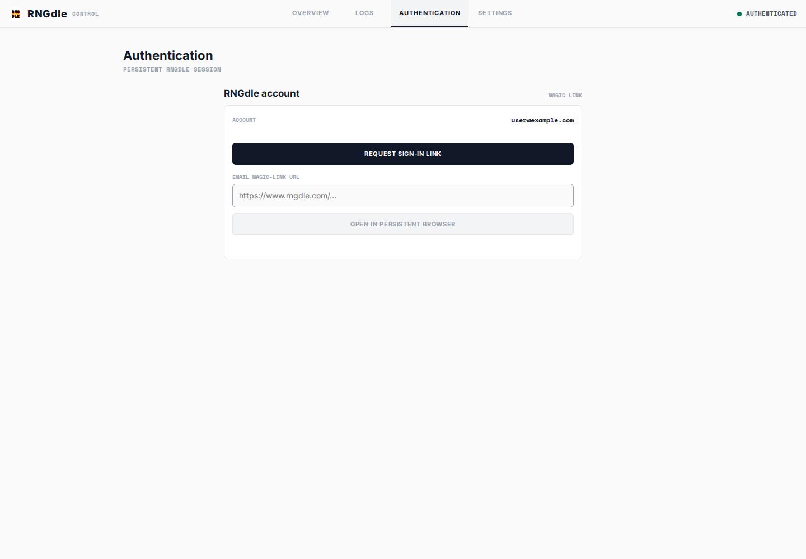

# RNGdle Automation

自托管的 RNGdle 每日自动化服务：每天 UTC+8 `08:02` 执行 roll，读取数字、EP、Lifetime EP 和 badges，并通过通用 SMTP 发送结果邮件。


## 功能

- Docker Compose 常驻调度，Playwright 持久化登录
- 登录失效时通过 Control 页面重新认证
- RNGdle roll 和邮件投递分别重试，任务幂等
- RNGdle 风格 HTML 邮件、纯文本邮件和邮件预览
- Control 页面提供 Overview、Logs、Authentication、Settings
- 浏览器会话、状态和运行时设置保存于 Docker named volume

## 部署

### 配置

远端服务器只需维护 `.env`。默认结构位于 [`config/default.yaml`](config/default.yaml)，随镜像一起发布，不需要复制或挂载 YAML。

```bash
cp .env.example .env
```

在 `.env` 中填写账号、收件地址和 SMTP 凭证：

| 变量 | 默认值 | 说明 |
| --- | --- | --- |
| `TZ` | `Asia/Shanghai` | 调度时区 |
| `SCHEDULE_TIME` | `08:02` | 每日执行时间 |
| `RETRY_MINUTES` | `30` | RNGdle roll 失败重试间隔 |
| `EMAIL_RETRY_MINUTES` | `1` | 邮件发送失败重试间隔 |
| `RNGDLE_EMAIL` | 必填 | RNGdle 登录邮箱 |
| `SMTP_HOST` | - | SMTP 主机 |
| `SMTP_PORT` | `587` | SMTP 端口 |
| `SMTP_SECURE` | `false` | `true` 表示 implicit TLS，通常用于 465 |
| `SMTP_REQUIRE_TLS` | `true` | 是否要求 STARTTLS |
| `SMTP_AUTH_MODE` | `password` | `password` 或 `oauth2` |
| `SMTP_USER` | - | SMTP 用户名 |
| `SMTP_PASSWORD` | - | SMTP 密码或应用专用密码 |
| `MAIL_FROM` | - | 发件地址 |
| `MAIL_TO` | - | 收件地址，可用逗号分隔多个地址 |
| `MAIL_FROM_NAME` | `RNGdle Today` | 发件人显示名称 |
| `CONTROL_PASSWORD` | 空 | 可选的无人值守初始化密码；未设置时首次访问进入 `/setup` |
| `CONTROL_SESSION_DAYS` | `7` | Control Session 有效期 |
| `CONTROL_COOKIE_SECURE` | `false` | HTTPS 部署时设为 `true` |

OAuth2 还需要 `SMTP_OAUTH_CLIENT_ID`、`SMTP_OAUTH_CLIENT_SECRET`、`SMTP_OAUTH_REFRESH_TOKEN` 和 `SMTP_OAUTH_ACCESS_URL`。旧变量 `MAIL_RETRY_MINUTES` 仍可作为 `EMAIL_RETRY_MINUTES` 的兼容别名。

配置优先级如下：

```text
config/default.yaml + .env
          ↓
/app/data/settings.json（Control 保存的运行时覆盖）
```

已有部署中的 `config/config.yaml` 可以保留，但新版本 Compose 不再读取它。需要自定义 YAML 时，通过 `CONFIG_PATH` 指向自己的文件，并自行挂载该文件。

### 启动

```bash
docker compose up -d rngdle
docker compose logs -f rngdle
```

打开 [http://localhost:3000](http://localhost:3000)。Control 默认只绑定 `127.0.0.1`。

### 首次设置与认证

1. 首次访问 Control 时，在 `/setup` 设置至少 8 个字符的 Control 密码；设置成功后会自动登录。
2. 之后访问 `/login` 输入 Control 密码。
3. 进入 Authentication 页面，点击 **Request sign-in link**，进入官方 RNGdle 登录页。
4. 填写邮箱并完成 Cloudflare Turnstile，接收 magic link。
5. 将完整的 `https://www.rngdle.com/...` 链接粘贴到 Authentication 页面并提交。
6. 等待状态变为 **Authenticated**。

验证码和 Turnstile 由官方页面处理。登录失效时，任务会暂停并通过 Control 和邮件提示重新认证。



## Control

- **Overview**：查看服务状态、最近结果、重试时间；右侧可 **Send email** 或 **Open preview**。
- **Logs**：查看结构化运行日志。
- **Authentication**：提交 magic link 并查看会话状态。
- **Settings**：分别设置 RNGdle 重试、邮件重试、调度和 SMTP。保存后立即生效并写入数据卷。

邮件预览使用与实际发送相同的模板：


Settings 中留空 SMTP 密码表示保留当前密码；密码不会通过 API 返回。
Control 密码哈希和 Session 摘要保存在数据卷的 `control-auth.json`，不会写入日志或返回给前端。

## 重试与幂等

- 已成功完成当天 roll 和邮件发送时，任务直接跳过。
- 已有当天 roll 时会复用结果，不会重新生成数字。
- RNGdle roll 失败按 `RETRY_MINUTES` 重试，默认 30 分钟。
- 邮件发送失败只重试投递，按 `EMAIL_RETRY_MINUTES` 重试，默认 1 分钟。
- 浏览器会话失效时暂停任务，认证完成后恢复。

手动执行一次时，先停止常驻服务：

```bash
docker compose stop rngdle
docker compose --profile tools run --rm --service-ports once
docker compose start rngdle
```

## 更新与数据

更新远端代码：

```bash
git pull --ff-only
docker compose up -d --build rngdle
```

named volume `rngdle_automation_rngdle-data` 保存：

- `browser-profile/`：登录 cookies 和 Playwright 会话
- `state.json`：每日结果、邮件状态和重试记录
- `settings.json`：Control 的运行时配置
- `control-auth.json`：Control 密码哈希和 Session

`docker compose down` 会保留数据；`docker compose down -v` 会删除登录会话、历史状态和设置。若要恢复 `.env` 的配置，删除运行时覆盖后重启：

```bash
docker compose exec rngdle rm -f /app/data/settings.json
docker compose restart rngdle
```

备份数据卷前请确认其中包含登录 cookies 和 SMTP 密钥。不要将 Control 直接暴露到公网，远程访问请使用 SSH tunnel 或私有 HTTPS。

## 本地开发

需要 Node.js 22+ 和 pnpm：

```bash
corepack enable
pnpm install
pnpm test
```

本地启动前导出 `.env`：

```bash
set -a; . ./.env; set +a
pnpm start
```
